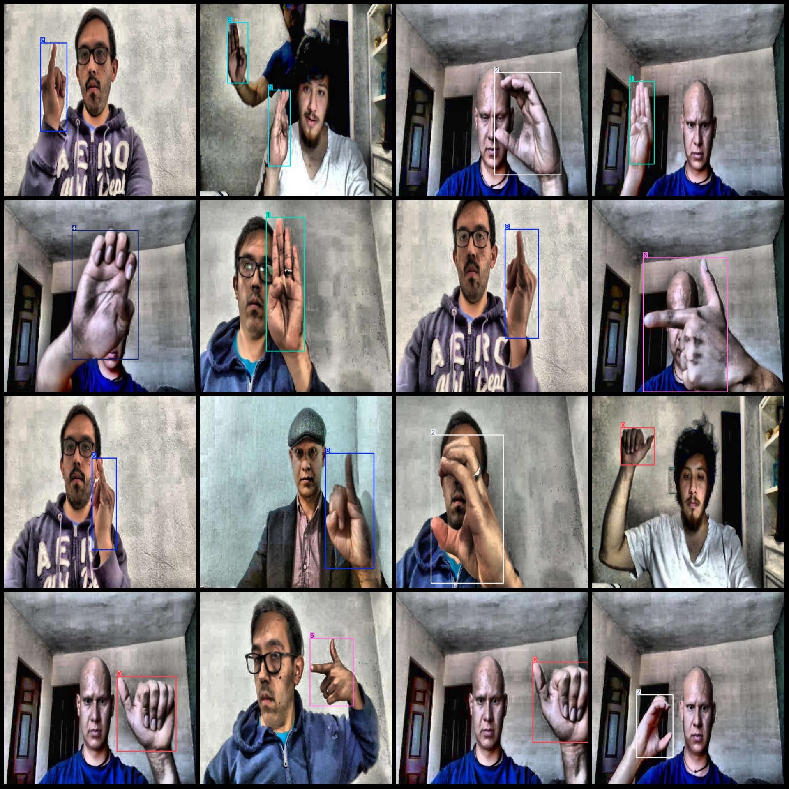
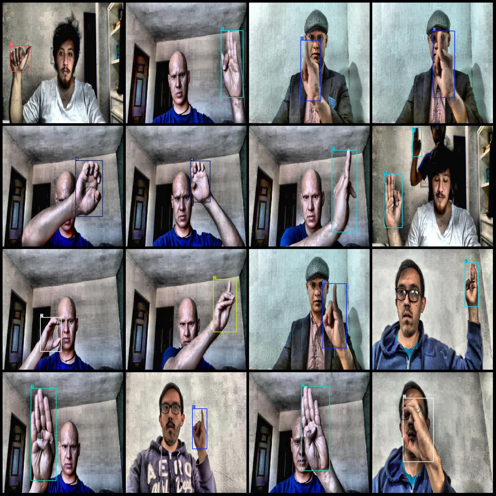

# Hand Gesture Recognition Dataset with VOC+YOLO Format: 2000 Images of 10 Categories

Pascal VOC format+YOLO format (without the split path in txtfile, only contain the jpg image and corresponding VOC format xml file and yolo format txt file)
number of images: 2000  
annotation count: 2000  
annotation count: 2000  
annotationnumber of classes: 10  
Annotation class names (Note: the order of YOLO format class names does not correspond to this, but is based on the labels file with classes.txt as the standard): ["0", "1", "2", "3", "4", "5", "6", "7", "8", "9"]
boxes per class:   
0 box count = 200  
1 box count = 200  
2 box count = 200  
3 box count = 200  
4 box count = 211  
5 box count = 228  
6 box count = 234  
7 box count = 200  
8 box count = 200  
9 box count = 200  
total boxes: 2073  
images per class:   
0 images = 200  
1 images = 200  
2 images = 200  
3 images = 200  
4 images = 199  
5 images = 201  
6 images = 200  
7 images = 200  
8 images = 200  
9 images = 200  
image resolution: 640x640  
Using the annotation tool: labelImg
Annotation rules: Draw a rectangle around the class.
Important notes: The dataset does not have a division into training, validation, and test sets; you need to divide it yourself.
Special statement: This dataset does not guarantee any accuracy for the trained model or weight file.
Image preview:
## Images

Here is a pay link on Stripe ( https://buy.stripe.com/3cs8yP7sY87d0vu9AB ). Please contact me lonlonago@foxmail.com after funding $89, and I will send you a complete data files , thank you!

